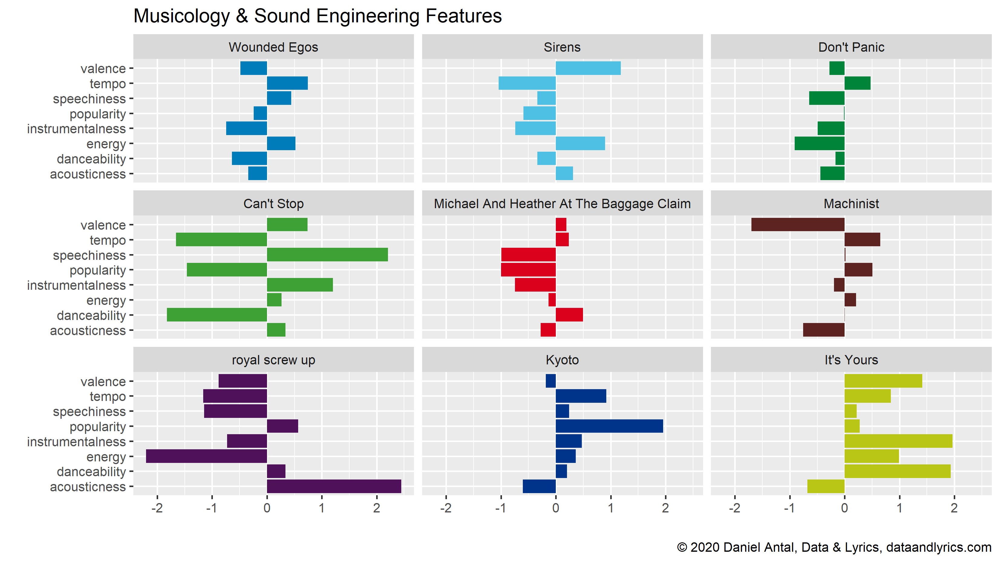

+++
title = "Listen Local: Open Collaboration Experiment & Feasibility Study"

date = 2020-10-18T18:00:00+02:00
lastmod = 2020-10-18T18:00:00+02:00
draft = false

authors = ["Daniel Antal, CFA"]

tags = ["musicology", "recommendations", "machine-learning", "playlist", "listen-local"]

summary = "Big data creates injustice. We want to help small venues, independent small businesses, great artists and dedicated fans to make algorithms work for them. We create locally relevant recommendations and measure their effect."

projects = ["listen-local", "Slovakia", "Netherlands", "Belgium", "Hungary", "recommendations", "playlists", "big-data", "algorithms"]

# Featured image
# To use, add an image named `featured.jpg/png` to your project's folder. 
[image]
  # Caption (optional)
  caption = "Listen Local Mindmap"

  # Focal point (optional)
  # Options: Smart, Center, TopLeft, Top, TopRight, Left, Right, BottomLeft, Bottom, BottomRight
  focal_point = "Center"

  # Show image only in page previews?
  preview_only = false

+++

*“Big data creates injustice.”* -- Cathy O'Neil, author of [Weapons of Math Destruction](https://blogs.scientificamerican.com/roots-of-unity/review-weapons-of-math-destruction/)

If you can train machine learning algorithms on millions of music fans, then you can very precisely find listeners in Bratislava, entire Slovakia, in the Slovak diaspora in the United States.  In Utrecht, in Flanders, in Japan. If you cannot, then your sales will be driven by Spotify, Apple, Amazon or Google’s YouTube. And you fill compete with millions, tens of million of songs in your own city.

When you have access to the entire analytics toolkit to fine-tune your mastering, your instruments, your tempo, when you know how to plug into the radio editors pre-screening, then you have chance for airplay. If you are all small, even local content guidelines, such as national radio quotas or public radio targets will not help you, because you remain invisible.

With the support of the [Slovak Arts Council](http://sgda.sk/#about), [SOZA](http://www.soza.sk/), non-profit civic association representing more than 2,600 rights holders in Slovakia and over 1 million abroad (musical works composers, lyrics and publishers), and [Consolidated Independent](https://ci-info.com/), a music distributor platform [Reprex](https://www.linkedin.com/company/reprexbv/) is preparing a feasibility study for the collaborative, transparent research tool and application that helps you to find your way to radio playlists, connect to fans in your own city, country, and in other towns along viable tour routes.  Make music export more of a science than a guessing game.

In the first step, *until the end of 2020*, we are going to create a demo application and a feasibility study with quantitative musicologists and data scientists. The demo application will show how to use AI to place the music of the volunteering bands and labels’s repertoire on radio lists and personal playlists.  Our feasibility study will show how different local content guidelines (radio quotas, public broadcaster targets, and other tools) can affect the market share of small local and national repertoires, and will provide culture policymakers and competition authorities with insight how to make the algorithm-driven music streaming, broadcasting marketplace more even.

## How can you participate in the experiment?

* In the first phase of the experiment, only artists released on Spotify can participate.

* Participation in the experiment is free.  The research findings, including potential targets for your music, will be fully open, transparent and free.

* If you are an artist, you can [simply fill in a form](https://www.surveymonkey.com/r/ll_collector_2020) identifying your music on Spotify, filling in a few biographical data about yourself (or your band, ensemble, group). We only ask about city affiliations, targeted cities, age, experience level, and language of your lyrics, if you do not play instrumental music. In our experience, these factors are very important among musicology and sound engineering quality measures. (Read a bit more in the previous [post](https://dataandlyrics.com/post/2020-10-18-october_playlist/))

* Our project originally started out of Slovakia, Hungary, Czechia and Poland, but we only found funding in Slovakia for a low-budget, open source, open data, open collaboration experiment. **Participation is open anywhere in the world**, but we are **focusing on a viable post-covid tour route** around Budapest – Bratislava – Vienna – Salzburg – Munich – Ruhr – the Netherlands – Belgium. We hope to give guidance on targeting both recorded and live music.

* If you represent several artists as a talent manager, music publisher, record label, granting agency or music export office, please get in [touch with us](https://dataandlyrics.com/#about) for onboarding. We will ask you to contribute a small sum on a crowdsourcing basis to expand our experimental project, but the small financial contribution is not a mandatory requirement.

*You can read a bit more about our longer-term plans, our budget and transparency ideas [here](https://dataandlyrics.com/project/listen_local/).*

