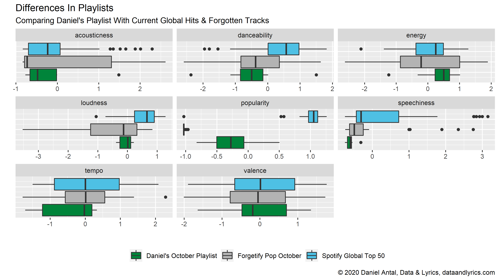
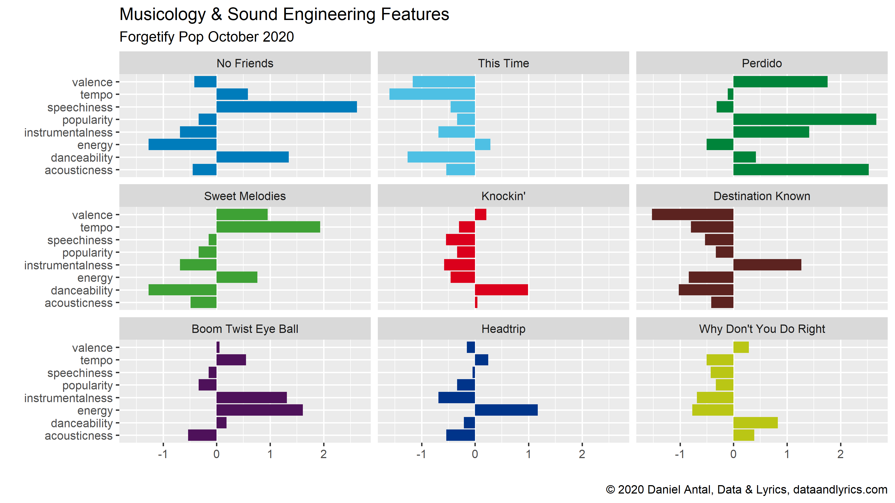
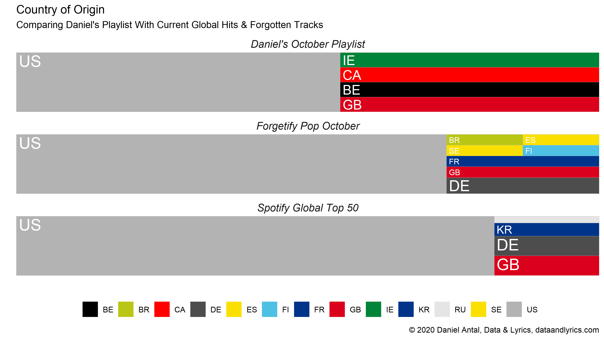

+++
title = "Forgetify: Popular Music That Nobody Listens To"

date = 2020-10-24T18:00:00+02:00
lastmod = 2020-10-24T18:00:00+02:00
draft = false

authors = ["Daniel Antal, CFA"]

tags = ["musicology", "recommendations", "machine-learning", "playlist", "listen-local", "forgetify"]

summary = "Forgetify is an application that is “recommending” you songs that have never been played on Spotify -- not even their family, friends or foes. When you design a recommendation engine for an artist or a label, you want to avoid that their songs ever arrive to Forgetify."

projects = ["listen-local", "music-observatory"]

# Featured image
# To use, add an image named `featured.jpg/png` to your project's folder. 
[image]
  # Caption (optional)
  caption = "Forgetify Pop October 2020"

  # Focal point (optional)
  # Options: Smart, Center, TopLeft, Top, TopRight, Left, Right, BottomLeft, Bottom, BottomRight
  focal_point = "TopLeft"

  # Show image only in page previews?
  preview_only = false

+++

When you work on recommendation engines, particularly recommendation engines that are different from the ones developed by large media or streaming platforms, you do not want to consider goals and directions that you follow, but also the road where you do not want to end up at all. For me, Forgetify has always been a puzzling and wonderful application, because it shows purely where your artists do not want to end up.

[Forgetify](https://forgotify.com/) is a wonderful application that is “recommending” you songs that have never been played on Spotify.  Music from artists that has not been played by their fans, their friends or foes, brothers and sisters, children and grandchildren! I use recommendations in quotation marks, because their recommendations are usually based on your taste. Forgetify just picks you a song that has not been played on Spotify ever. (Never been played means that somebody may have started it, but very soon stopped playing the song.)

What connects me to Forgetify particularly is their motto: “We love music.” 

As you can learn from their website, there are millions of Spotify songs that have been played only partially or never at all. And that is exactly the opposite that our partners want to achieve when they work with us.

I started to create several playlists with Forgetify.  All I did is that I took their “recommendation” and put it on a list, then hit next.  I skipped tracks that were not licensed to the Netherlands, or which were not music tracks but spoken words, for example sound recordings of stand-up comedies. Then I put these tracks on three lists 

* something that I felt was appropriate called `classical music`
* another that is `popular music`
* and another which is a mix of historical recordings, and other music which I think has such a special audience that it would not make a good mix with the other two. 

For example, the [Eightsome Reel Pt 1](https://open.spotify.com/track/3Gs4kJzmFiMNMfPAuhmC6P) by the *Bob Smith's Ideal Band* is a digitalized re-release of the LP re-release of 78'' records from the 1930s, and it is obviosuly no competitor for a modern classical or pop music track. Even the labels `popular music` or `classical music` would call for further explanation, but we'll get there another time.

So, let's see what we have after removing historical, traditional folk, spoken word and classical music tracks in the supposedly `popular music` "recommendations":

<iframe src="https://open.spotify.com/embed/playlist/1kxZfYZBsDSdWhMVXQMCss" width="740" height="410" frameborder="0" allowtransparency="true" allow="encrypted-media">
</iframe>

Similarly to the use of the the word “recommendations”, the expression of “popular music” is a bit ironic here, because we are talking about music that is anything but popular, at least not on Spotify.

First let's make a very short [comparison](#comparison) of the current global hits, [a subjective list](https://dataandlyrics.com/post/2020-10-18-october_playlist/) that I created for this month and started to use for explaining our recommendations, my *Forgetify Pop October 2020* list.  I will follow these songs in the coming years, and will keep adding new forgotten songs to my list. Then I'll reflect on why these songs are [forgotten](#forgotten).

## A Quick Comparison {#comparison}

The next comparison uses some musicology and sound engineering
“features” of the songs on the three lists. These characteristics
are themselves recognized by algorithms, and they are used for Spotify’s own recommendations.

If anything is clear from these boxplots is that there is nothing clear about forgotten songs. The boxplot's box show the typical values of popularity or other features, and the line starting from the box still relatively frequent values.  The long boxes of the Forgetify Pop list show that there are all sorts of music on Forgetify: screechy and not, danceable and not, cheerful and sad. My subjective list is shorter and more pronounced: it contains songs that I found to be a good match to listen together.  The current global hits are less similar than my personal selection, but far more homogeneous than all those millions of songs that end up in the forgotten long tail of the catalogue.

Of course, the only thing that connects this playlist is that the songs are not classical or world/folk music, and that they are forgotten. The [This Time](https://open.spotify.com/track/62y0aOSPRK1rL7lo780cgH) single from 2009 by the Intonated (3 listeners this month, including myself) is heavy guitar music. It is dark. [Perdido](https://open.spotify.com/album/6cCHMZdMkfhpebJ0s6rRNR) from the *Candido Featuring Al Cohn* album released in 1956 by the 
Cándido Camero (6945 monthly listeners) is a cheerful jazz song. It is likely that this song actually has an audience, but not on Spotify. [Cándido](https://en.wikipedia.org/wiki/C%C3%A1ndido_Camero) was born as Candido de Guerra Camero in 1921 in Havana, and with his 99 years he is one of the oldest living artists on Spotify. He recorded this album almost 40 years before the internet was opened for the public. For his life long achievement in Afro-Cuban jazz he received the National Endowment for the Arts Jazz Masters Award in 2008.

My personal favorite from the Forgetify Pop list is [Groovy & Linda](https://open.spotify.com/track/21nQDfg5BMxp7vGARpOBmo) from the *Neon Princess* album released in 1968 by Tom Parrott (39 monthly listeners). It is a nice hippy song with the favorite effect of '68, the inclusion of a sitar.  The song is not very good, the sitar and the guitar make a rather chaotic mix, but Tom Parrott (born in 1944, Washington DC, United States) is not forgotten because he was bad. There are many songs on Forgetify that I would like to skip in seconds, but Parott's music can stay with me.

## Why Are Songs Forgotten? {#forgotten}

One seemingly trivial reason is the age of the music. The current global hits are very new releases. The songs I curated for this months were released 2-25 years ago, though some of them are featured with newer re-releases on Spotify. Many songs on Forgetify are much older.

Our research and other's research show that people *typically* listen less and less music as they age. There are many people who listen to music lifelong, but others do it less and less, or completely drop the habit. And a large majority of the people tend to listen to similar music that she liked in her teenage years. For most young women and men, the music discovery period ends with school,  *typically* in some post-secondary education institution. Later, they are no longer together with ther cohort peer-grew, but with people from all age and demographic groups when they work. Very few songs become perennial hits, and most of them lose their audience as the fans are getting older, and drop the habit of listening to music.

How can you make sure that your music will have a healthy audience for many years to come? Make sure that teenagers in your country get access to local music, for example, via the school radios, and by bringing them to local shows. That people have a chance to discover it. Build a large enough audience while your band is active who will stay loyal to you. 

Another important factor is the country where the music was released. Most of the current global hits come from the United States, and some from the United Kingdom, South Korea, Germany and Russia. My personal selection included the [dEUS](http://www.deus.be/) from Antwerpen, Belgium, [David Kitt](http://www.davidkitt.com/) from Dublin, Ireland, and [The Harmaleighs](https://www.theharmaleighs.com/home) Nashville, TN, are Americans who were released by 
Nettwerk Music Group in Vancouver, Canada.

The forgotten tracks come from all over the world.  Many of them are Americans, because the US has the biggest recording industry and recorded far the most songs in the last 100-120 years. But on Forgetify my first 50 finds contained songs from Brazil, Finland, France, India, Palestine and Spain, not to mention plenty of classical recordings made all over the world.

Spotify has a global audience, but it's main audiences are in the US, Japan, South Korea, Germany and the United Kingdom.  It's algorithms are trained to serve these audiences, and its new content is coming from these countries. And it recommends very goods songs from these places.

Because concert and festival promoters, and even radio editors are often basing their decisions on YouTube, Spotify, Apple Music followers, streams and likes, the global platforms may make it extremely difficult for niche genres (for example, ancient or classical music), or small nation artists (such as Slovaks, Belgians) or older artists to get heard.

I personally do not believe that it is entirely the platform's fault. Our [Listen Local initiative](https://dataandlyrics.com/project/listen-local/) is aiming to use these platforms better, and find global audiences for great music made in small nations and small towns, or niche genres.