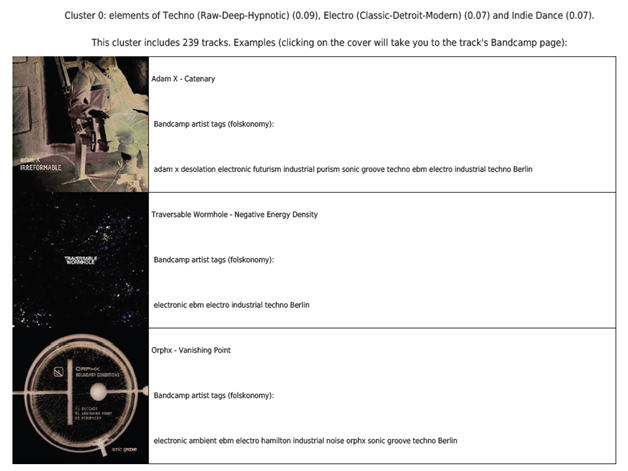
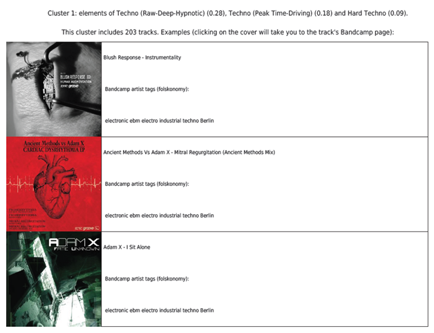
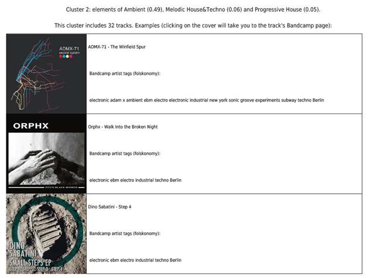

+++
title = "How to Speak About Music in the Digital Age from Taxonomies to Folksonomies"

date = 2021-03-05T15:00:00+02:00
lastmod = 2021-03-05T15:00:00+02:00
draft = false

authors = ["Botond Vitos"]

tags = ["listen-local", "Digital Music Observatory", "library", "Bandcamp", "clustering", "musicology"]

summary = "As a cultural anthropologist, I have been involved in the study of alternative electronic dance music communities and event-based cultures. The Bandcamp Dance Librarian project grew out of this work. It uses the industry taxonomy of Beatport in an attempt to detect stylistic tendencies or repertoires within the Bandcamp libraries of (mainly) grasroots labels. The project output also show the tags (folksonomies) added by the artists/labels to the Bandcamp pages. It is therefore possible to compare the industry taxonomy of Beatport with artist folksonomies, as long as such tags are provided on Bandcamp, and eventually create a searchable system in this kaleidoscopic musical landscape, which can be especially useful for newcomer researchers, promoters, music exporters."

projects = ["listen-local"]

# Featured image
[image]
  # Caption (optional)
  caption = ""

  # Focal point (optional)
  # Options: Smart, Center, TopLeft, Top, TopRight, Left, Right, BottomLeft, Bottom, BottomRight
  focal_point = "Right"

  # Show image only in page previews?
  preview_only = false

+++

Since the dawn of the digital age we have experienced an unprecedented proliferation of music tied to the emergence of digital tools and media channels that accelerate its production and dissemination. Music streaming platforms like Spotify, media platforms like YouTube, or alternative sales platforms like [Bandcamp](https://bandcamp.com/tags) make around 100 million songs available worldwide.

From a conservative viewpoint the fact that everything is readily exposed to us (i.e. the flooding of content) can be seen as degrading to the cultural experience; conversely, one can celebrate the growth of free digital culture, where music production and promotion is tied to less constrains, and musical experience is enriched by blogs, podcasts and other music promotion services.

We do not need to take sides, but we might agree that the digital explosion does not equate to instant access to relevant content — in certain cases it may trigger the opposite effect. There is so much music out there, with so many releases every week, that even professional users like radio editors, DJs or curators face challenges staying up to date. For the audience, this is even more challenging, and therefore all these platforms rely on some form of AI to make personalized recommendations or to automate the categorization of music.

Music might have a universal language, but finding music is rooted in natural languages, and users rely on simple verbal identifiers like genre labels. According to their broad [definition](https://www.tagg.org/others/ffabbri9907.html), musical genres emerge as names to define similarities that identify musical events for the members of a community. These labels aid orientation within the sonic landscape, and make it easier for humans to give recommendations in a human conversation — and they are attached to extra-musical activities, too, because music is a social activity.

One goes to a concert and meets like-minded people, or at least there is a sense of togetherness triggered by a shared appreciation of the music. Music events are embedded into socio-cultural contexts that may prescribe forms of belonging, dress and behaviour codes, and are prone to economic regulation. Within popular music studies a range of concepts have been developed to grasp such communities, such as subcultures, neo-tribes or music scenes. One must take into account the multitude of sometimes overlapping subgenres and their varying interpretations by music lovers, which makes categorization even harder. More generic genre descriptions, like “rock” or “punk”, may sound straightforward and less confusing, but they are also less useful for uncovering complexities and nuances. More specific categories, like “darkwave” or “cold wave”, are more practical in this regard, but may sound pretty obscure or even esoteric to a non-specialist audience.

___

Music tech companies that support labels, A&R, music supervisors, DJs, radio editors, music journalists, and the entire music and entertainment industry, attempt to cut through the turmoil of genre labels by providing (and improving) relatively detailed taxonomies, or well-designed labels that help both humans and AI-powered robots to find and connect to music. [Beatport](https://www.beatport.com/), for example, is focused exclusively on electronic dance music, distributing its catalogue into 33 subgenres (as of Jan 2021, and counting).

Of course, Beatport’s subgenre categories are not carved in stone. Particularly in electronic dance music, a meta-genre featuring [a very high number of subgenres](https://music.ishkur.com/), such labels are often contested, and when it comes to niche genres, bottom-up, free tagging systems or *[folksonomies](https://www.vanderwal.net/folksonomy.html)* may better capture diversity and creativity, although they are less exact by their nature. These tags are rooted in the authentic, verbal descriptions of artists and promoters, and may refer to affective qualities and localities or express free associations.

The abundance of subgenres is a hallmark of not only electronic dance music, but also of various indie, hip-hop, jazz or other music that has lively scenes and active, emerging artists. Within electronic dance music, scholars attribute it to various factors.

Subgenre naming can be part of a merchandising strategy, related to a top-down model of genre categorization, where taxonomies are established by vendors or industry representatives such as Beatport. It may also reflect socially accepted musical qualities and innovations; folksonomies, by their nature, are at the forefront of such stylistic innovations. Folksonomies are also supported by certain independent music promotion and marketing websites. Bandcamp, for example, is seen as a reputable platform within the indie music community, and it also provides tagging possibilities for its artists and labels. In certain cases, such tags may offer a refreshing contrast to Beatport’s genre categories.

___

As a cultural anthropologist, I have been involved in the study of alternative electronic dance music communities and event-based cultures; as is often the case, this interest has permeated into my personal life. Consequently, I have first hand experience of grassroots artists resisting classification to their music on the grounds that such labels are narrow and limiting — especially when they are defined by major industry vendors. At the same time, such categories provide basic orientation within a kaleidoscopic musical landscape, which can be especially useful for newcomers to a music scene.

The [Bandcamp Dance Librarian](https://pypi.org/project/bandcamp-librarian/) project grew out of these impressions. In short, the project uses the industry taxonomy of Beatport in an attempt to detect stylistic tendencies or repertoires within the Bandcamp libraries of (mainly) grasroots labels. To achieve this, an automatic subgenre classifier is trained on Beatport’s Top-100 lists, which identifies the possible subgenres a track may belong to based on an audio analysis of its musical features. The classifier is then applied to detect the styles a Bandcamp library may belong to. The tracks pertaining to the whole library are first individually analysed, then distributed into groups or clusters based on their possible subgenre affiliations. The project output also show the tags (folksonomies) added by the artists/labels to the Bandcamp pages. It is therefore possible to compare the industry taxonomy of Beatport with artist folksonomies, as long as such tags are provided on Bandcamp.

Let’s take a look at a working example. [Sonic Groove](https://sonicgroove.bandcamp.com/) can be described a Berlin-based industrial techno label with strong EBM (Electronic Body Music) influences from a niche side of the electronic dance music spectrum. Neither industrial nor EBM techno are part of the Bandcamp taxonomy, so one can expect that the closest subgenres will be detected by the classifier. After running the Librarian we get a PDF report proposing three clusters with the following timeline distribution (the clustering algorithm may give different results each time):

## Cluster 0: Techno, Electro and Indie Dance

The first group (Cluster 0) is tentatively associated with the (*Raw-Deep-Hpynotic*) Techno, (*Classic-Detroit-Modern*) Electro and Indie Dance Beatport genres (the numbers in brackets represent confidence values). Three track examples are provided within each cluster, with links to their Bandcamp pages and their associated folksonomies:

<iframe src="https://open.spotify.com/embed/playlist/6n1b560ejaDz3Gfqj7ZlIa" width="300" height="380" frameborder="0" allowtransparency="true" allow="encrypted-media"></iframe>

## Cluster 1: Techno to Hard Techno

The second group is crystallized around more evident techno influences according to the classifier:

<iframe src="https://open.spotify.com/embed/playlist/465WEBBmdsG2fIrmGq0KwZ" width="700" height="380" frameborder="0" allowtransparency="true" allow="encrypted-media"></iframe>

## Cluster 2: Ambient

Finally, the last cluster is predominantly classified as ambient. The example tracks are highly atmospheric, and their beats are less pronounced.

<iframe src="https://open.spotify.com/embed/playlist/48snI8H5RyBBinAJh0Zvq0" width="700" height="380" frameborder="0" allowtransparency="true" allow="encrypted-media"></iframe>

The tags associated to the tracks refer to subgenres (*EBM, industrial and electro*), aesthetic modes (*purism, futurism*), localities (*Berlin, Hamilton, New York*) and moods (*desolation, subway*).

*In the next blogpost I will get into more details on the project, discuss additional examples and touch on possible ramifications of this work.*

## References

- Charles, Christopher. 2020. “Genre in Practice: Categories, Metadata and Music-Making in Psytrance Culture”. Dancecult: Journal of Electronic Dance Music Culture, no. 12 (1): 22–47.
- Fabbri, Franco. 2007. “Browsing Music Spaces: Categories and the Musical Mind”. Critical essays in popular musicology, ed. A. Moore, Aldershot: Ashgate. 49–62.
- Graham, Stephen. 1996. Sounds of the Underground: A Cultural, Political and Aesthetic Mapping of Underground and Fringe Music. Ann Arbor: University of Michigan Press. 115–124.
- McLeod, Kernbrew. 2001. “Genres, Subgenres, Sub-subgenres and More: Musical and Social Differentiation Within Electronic/Dance Music Communities”. Journal of Popular Music Studies, no. 13 (1): 59–75.
- Vander Wal, Thomas. 2007. “Folksonomy Coinage and Definition”. Off The Top. [https://vanderwal.net/folksonomy.html](https://vanderwal.net/folksonomy.html).