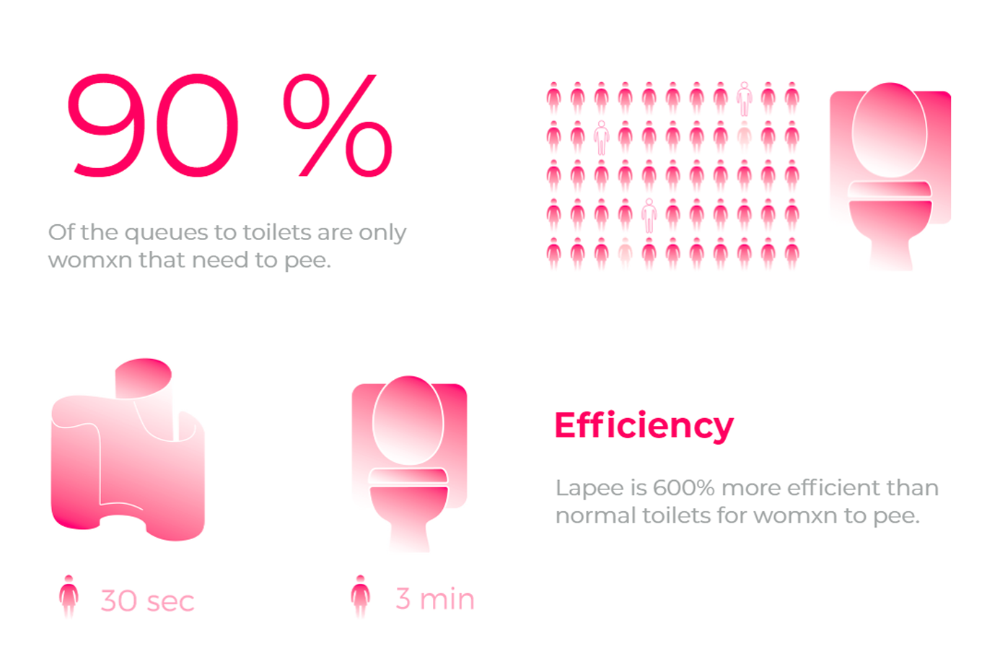
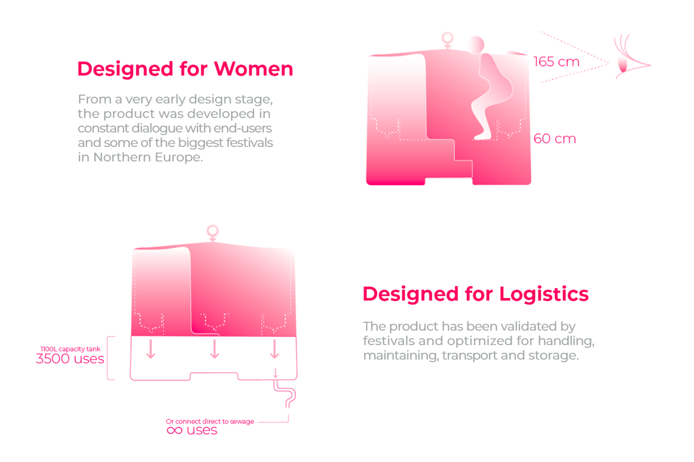
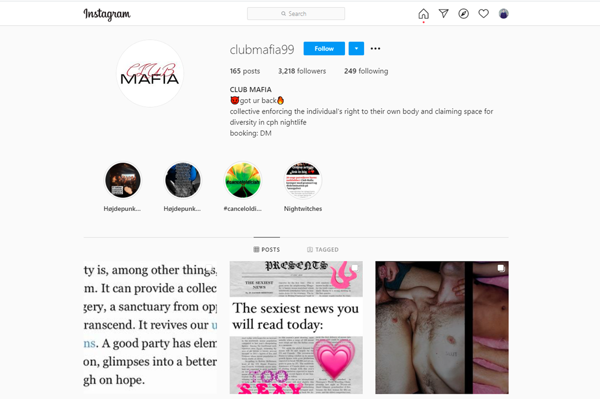
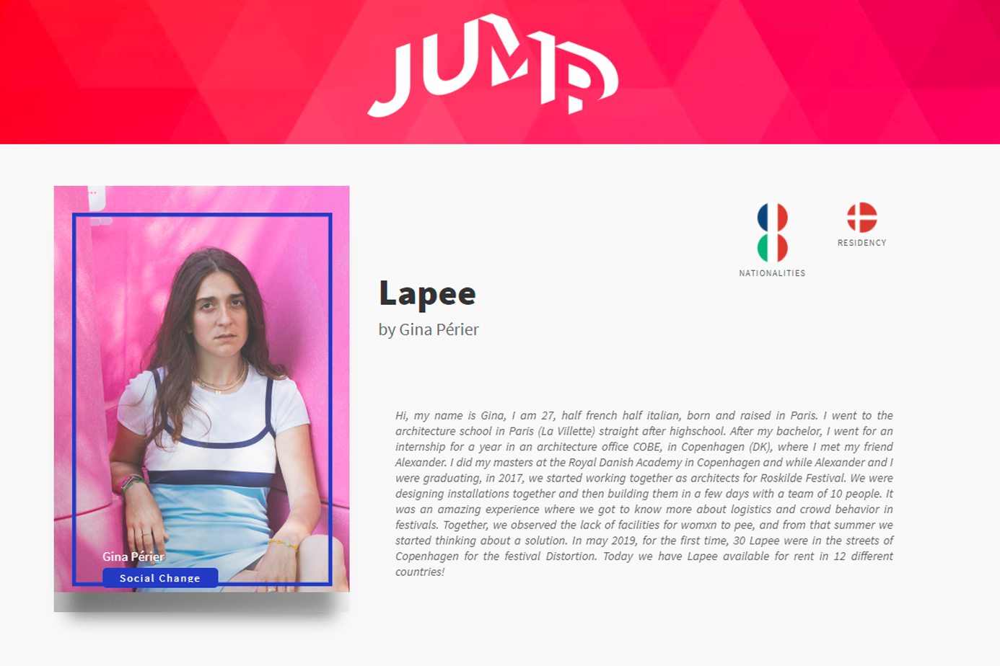
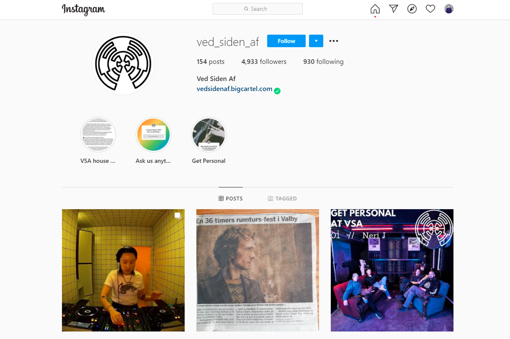
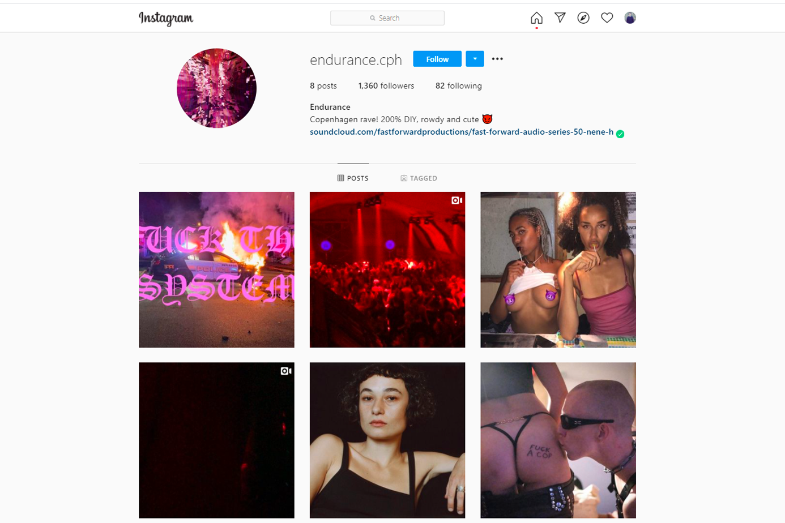

+++
title = "Lapee: Making Festivals More Accessible For Women"

date = 2021-03-10T19:19:00+02:00
lastmod = 2021-03-10T19:19:00+02:00
draft = false

authors = ["Daniel Antal"]

tags = ["feminism", "live-music", "future", "JUMP", "Denmark", "Copenhagen", "startup"]

summary = "Gina Périer is a fellow in the JUMP European Music Market Accelerator. She is an architect trying to solve a serious problem before music festivals reopen after the pandemic: many, many women, all in one place… who need to pee."

# Featured image
[image]
  # Caption (optional)
  caption = "Walking around the festival populated with male urinals, it was quite hard to understand why there wasn’t a proper industrialized solution for womxn yet."

  # Focal point (optional)
  # Options: Smart, Center, TopLeft, Top, TopRight, Left, Right, BottomLeft, Bottom, BottomRight
  focal_point = "Right"

  # Show image only in page previews?
  preview_only = false

+++

**Gina Périer is a fellow in the JUMP European Music Market Accelerator. She is an architect trying to solve a serious problem before music festivals reopen after the pandemic: many, many women, all in one place… who need to pee.**

**What is your personal connection to music and festivals?**

First of all, I like going to festivals, partying and listening to the concerts. Then, I used to work as an architect for Roskilde Festival in Denmark, together with my co-founder Alexander. For us, it was a great opportunity to observe the impact of our design on the festival and on the crowd behavior. We started then observing issues around and trying to find simple solutions to improve the festival environment.

**Lapee gives womxn the ability to pee in a secure and clean environment without waiting in line. Apart from personal experience, what sort of research did you do to understand the scope of the problem and the potential market? How do you feed back user experience to the design process?**

While being at the festival that I was working for, I was extremely concerned about how difficult it was to just pee as a womxn. No matter how much fun I was having, when it comes to pee, everything turns into a nightmare because we know we’re on to a good struggle. We’ll probably lose our friends, miss half of the concert, stay in an endless line to finally lock ourselves into a sticky cabin. Many times we would go for the “other option,” commonly known as the bushes, which is quite unpleasant.

Walking around the festival populated with male urinals, it was quite hard to understand why there wasn’t a proper industrialized solution for womxn yet.

When we started drawing Lapee, we made some 1/1 cardboard models and we invited different womxn to check it out.

**Can you name another product or service that help womxn to participate more in music, either as members of the audience, or as creators, or technicians that you like?**

I think that safety is still quite an issue within the music industry. I have a friend who created an organisation, Club Mafia, which consists of having a community of people that can educate and help people in trouble or making trouble. Basically they are people in between safety guards and participants that are easier to reach out to and that are more understanding and value minded. They will listen to you if you feel uncomfortable and will go and explain to the person how not to make someone uncomfortable. I think it’s a great initiative!

I would say that the major problems I can observe in music are sexism, queerphobia and racism, and some ideas can help fighting against them.

So I hope for more ideas that can improve equality. I also really hope for music organisations to speak up, be inclusive, promote better equality and not tolerate sexism, queerphobia and racism. The audience should educate themselves and organisations should use their power and influence to speak and educate their audience.

**You were selected to JUMP along with us. What do you expect to gain from this European Music Accelerator?**

I hope to develop a great relevant network and make Lapee a normality in festivals :)

**In our [Listen Local](https://dataandlyrics.com/project/listen-local/) project, we try to bypass recommendation and gatekeeper biases and make sure that local music scenes are connected to local people, and not colonized by the global music industry. Can you recommend any bands, labels, or local festivals from the area where you live?**

Check out this:

… and this:

## How many awards has Lapee won?
Shortlisted for the Danish Design Award in DK — Shortlisted in the Best Toilet Provider in UK — Shortlisted in the Best Green Supplier of the year in UK — 2nd prize Green Supplier and Innovation Award in the UK — 1st prize in Global Creative Business Cup 2019 — 1st prize in Creative Business Cup DK — 2019 Gina Périer as rising star of the year from Women Tech Summit DK — 2019 Golden metal of concours Lépine in FR 2019 Best Danish-French startup in DK — 2019 Best startup at the She conference in NO — 2019 Finalists of the Danish tech challenge in DK 2018

## Further Lapee details

**All product photos and infographics are taken from [lapee.dk](https://www.lapee.dk/). Gina is very vocal that the product is meant to be a safe, quick, comfortable choice for everybody who identifies as a woman, but it should not be viewed as a unisex solution. “Who ever identifies as women or femme, and feels safer squatting, is more than welcome to use Lapee. Boys you pee literally e-v-e-r-y-w-h-e-r-e, leave some space for the girls please. Thanks!”**

## Links

- [Lapee](https://www.lapee.dk/)
- [Gina Périer JUMP fellow 2021](https://www.jumpmusic.eu/fellow2021/lapee/)
- [clubmafia99](https://www.instagram.com/clubmafia99/)
- [ved_siden_af](https://www.instagram.com/ved_siden_af/)
- [endurance.cph](https://www.instagram.com/endurance.cph/)
- [Listen Local](https://dataandlyrics.com/project/listen-local/)
- [JUMP European Music Accelerator](https://www.jumpmusic.eu/)