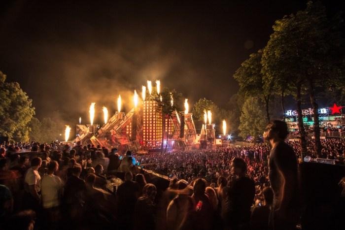

+++
title = "From France: Destination East"

date = 2021-03-21T19:19:00+02:00
lastmod = 2021-03-21T19:19:00+02:00
draft = false

authors = ["Daniel Antal"]

tags = ["Hajde", "France", "Skopje", "North-Macedonia", "festivals"]

summary = "HAJDE is a digital platform specializing in eco-responsible and cultural tourism in Eastern Europe. Its founder, Thibaut Boudaud, is developing his project alongside our music observatory in the JUMP European Music Market Accelerator."

# Featured image
[image]
  # Caption (optional)
  caption = "Thibaut Boudaud, JUMP fellow in 2021"

  # Focal point (optional)
  # Options: Smart, Center, TopLeft, Top, TopRight, Left, Right, BottomLeft, Bottom, BottomRight
  focal_point = "Top"

  # Show image only in page previews?
  preview_only = false

+++

HAJDE is a digital platform specializing in eco-responsible and cultural tourism in Eastern Europe. Its founder, Thibaut Boudaud, is developing his project alongside our music observatory in the JUMP European Music Market Accelerator. I spoke with him on a video platform.

*His first memories about the region are connected to his father, who served in the French zone of divided Berlin. Thibaut started to travel the region in 2008, starting with a memorable visit with Hungary’s Sziget Festival, then going further to Romania and Croatia. He has kept going back ever since: he has already visited 10 festivals in the region. On road trips with friends, on a crowdsourced fact-finding mission: he has found many ways to go back and get familiar with more and more places. I am particularly interested in Thibaut’s project, because he comes from a trajectory unknown to me, from France to the heart of the Balkans in Northern Macedonia. We have crossed each other’s routes, not yet knowing each other, on at least three occasions: on Sziget, in the summer of ’13 in Bosnia, and on the Sharpe showcase festival in Bratislava. Inspired by his travels, Thibaut went back to France to study first political science, then cultural policy, and decided to start a volunteer-based journalism website that opens up hidden aspects of the Balkans for the French readership.*

Thibaut’s [hajde.fr](https://hajde.fr/) was founded as a volunteer media site in 2016. He is fascinated with the cultural richness and the generosity of the people. However challenging the living conditions of the people he has met in Albania, North Macedonia or Montenegro, they give all to the traveler, and they always want to make sure that he returns with a good memory of their city or country. Thibaut managed to meet 60 cultural stakeholders in 8 countries on his four-month fact-finding expedition [Bridges to the Balkans] that was crowdfunded on [KissKissBankBank](https://www.kisskissbankbank.com/fr/projects/bridges-to-the-balkans). He is the first accredited journalist to cover a number of places, including the [Lovefest Festival](https://hajde.fr/serbie/lovefest-serbie-vrnjacka-banja-festival-electro/) in Vrnjačka Banja (see their Facebook page [here](https://www.facebook.com/lovefestVB/)).

> From an organizational point of view, the festival is functioning quite well. We may regret imperfections here and there, whether in terms of crowd management in rainy weather (expect a lot of mud), or even the behavior of security (one of the members of the editorial staff, who did not speak Serbian, was told “learn to speak Serbian” from a security guard), but the facts are there, the festival is running smoothly.

>The stages, too, are extremely well designed, from the Fire Stage, the main stage, where a metal juggernaut spits flames, to the Energy Stage, a more convivial stage hidden among the trees, on which rising stars give their best. Soundwise, the design is flawless: even when two stages are side by side, the acoustics have been so well designed that there will be no interference. In short, enough to have a good time in front of good DJs. On a programming level, the choices are consistent. While it was still possible a few years ago to meet Balkan rock stars on stage, such as [Partibrejkers](https://en.wikipedia.org/wiki/Partibrejkers) in 2016 or [SARS](https://en.wikipedia.org/wiki/SARS_(band)) in 2012, the festival is now 100% electro, from international references such as [Stephan Bodzin](https://soundcloud.com/stephanbodzin) to rising Serbian stars like [Lea Dobričić](https://soundcloud.com/leadobricic) . If you are a fan of electro, you will not have much time to spare during these four days.

Thibaut is particularly interested in national showcase festivals. He visited MaMA Festival 2018 in Paris as he was working for [Europavox](https://www.europavox.com/), the first European cultural media outlet for music lovers, and had the opportunity to visit [MENT](https://www.ment.si/news/) in Ljubljana, [Sharpe](https://sharpe.sk/) in Bratislava and [PIN](https://www.facebook.com/pinmusicconference/) in Skopje. He also met [Emily Gonneau](https://emilygonneau.wordpress.com/contact/), the music and tech entrepreneur and author who became a supporter of Hajde.

Thibaut started to think about professionalizing Hajde with the North Macedonian creative agency and artist group [Fabricca](https://www.fabricca.cc/). They had a shared vision, and eventually a grant from the French cultural ministry allowed a complete redesign of the website and social media.

Hajde is currently published by *Association Hajde Creative*, and relies on [donations](https://fr.tipeee.com/hajdefr), crowdfunding and volunteers, but plans to find new revenue streams connected to tourist guides, cultural tourism, and festival tourism — among other ideas — to actually start to pay its citizen-journalists and to create more and even better content. Thibaut also wants to provide a different perspective on the region than is currently available in the French-language press. “People only hear that [*Hungarian Prime Minister*] Viktor Orbán is terrible, that [*Serbian prime minister*] Vučić is terrible. They hold very prejudiced views of Albanian or Romanian people. I want to show that there are many great things happening in the region, and there are many creative people doing great things in these countries.”

<iframe width="100%" height="166" scrolling="no" frameborder="no" allow="autoplay" src="https://w.soundcloud.com/player/?url=https%3A//api.soundcloud.com/tracks/1010853100&color=ff5500"></iframe>
<a href="https://soundcloud.com/hajde-radio" title="HAJDE" target="_blank" style="color: #cccccc; text-decoration: none;">HAJDE</a> · <a href="https://soundcloud.com/hajde-radio/2-destination-est-budapest-avec-julie" title="#2 Destination Est - Budapest avec Julie" target="_blank" style="color: #cccccc; text-decoration: none;">#2 Destination Est - Budapest avec Julie</a>

Hajde’s founder applied to the [JUMP European Music Market Accelerator](https://www.jumpmusic.eu/) to create [Hajde Radio](https://hajde.fr/general/actus/hajde-lance-hajde-radio/), a music-oriented podcast and radio program, but this is only viable within a broader concept. Thibaut wants to create a self-brand as a curator, to find affiliations with cultural tourist destinations and festivals with all his media, and to generally show a different side of the region to a French-speaking audience. His plan has three focus points:

- “**Trendings**” brings together articles dealing with cultural discoveries (music, cinema, arts and literature, lifestyle), as well as the latest news and social trends for a better understanding of these countries.

- “**Go East**” will be the ultimate tourist guide to Eastern Europe, with must-see places (heritage, natural sites, cultural and underground places) and discoveries (food, traditions, green activities, outdoor activities and well-being). The expertise of its editors help the tourist choose the next destination, prepare for visits and take the time to travel in “slow tourism” style.

- “**Festivals**” and music have been in Hajde’s DNA since its beginning. Regularly updated pages are dedicated to the biggest festivals in the East as well as the most under-the-radar.

<iframe src="https://open.spotify.com/embed/playlist/6ESirwBrnBsIwocFK2hsmp" width="700" height="380" frameborder="0" allowtransparency="true" allow="encrypted-media"></iframe>

We hope that we can find a greater coverage for our [Music Observatory](https://music.dataobservatory.eu/) together with Hajde. Our [initial research area](https://ceereport2020.ceemid.eu/) almost fully overlaps with Hajde’s, with the exception of Austria, and while we have been covering Croatia, Slovenia, Serbia and Bulgaria for a long time, we have not yet found a way into Montenegro, Bosnia-Herzegovina and North Macedonia, where Hajde already has a strong network. They are also planning the launch of an app, where we see many connection points with our [Listen Local](https://dataandlyrics.com/project/listen-local/) initiative and apps. Placing [Croatian blues](https://hajde.fr/croatie/musique-croatie/blues-croate-daujourdhui/), or placing Skopje on the global music map are exactly the type of challenges where we are looking forward to cooperating with Hajde’s community — as well as the [Scene City EU](https://www.facebook.com/scenecityeu/) project, which documents and showcases European scenes.

Thibaut is particularly fond of Northern Macedonia, a country where he has travelled extensively, and where he hopes to buy a house one day. I asked him to recommend some tunes from Skopje and the rest of the country. Enjoy the playlist!

<iframe src="https://open.spotify.com/embed/playlist/0VnniFMWtqKrqTScEjmtc8" width="700" height="380" frameborder="0" allowtransparency="true" allow="encrypted-media"></iframe>