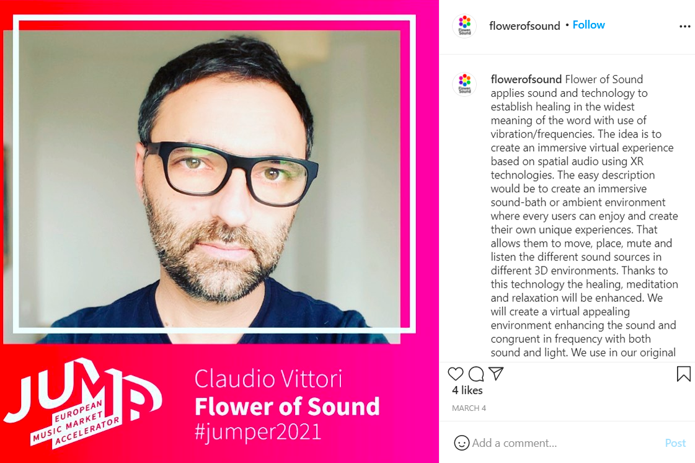
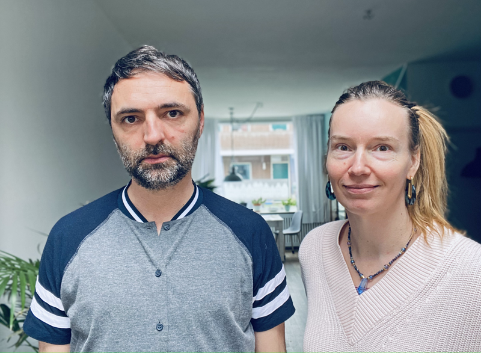

+++
title = "The Healing Effect of Sound and Music"

date = 2021-03-22T19:19:00+02:00
lastmod = 2021-03-22T19:19:00+02:00
draft = false

authors = ["Daniel Antal", "Emily Hansell Clark"]

tags = ["Amersfoort", "Milano", "music therapy", "sound design", "startup", "JUMP Europen Music Market Accelerator"]

summary = "Flower of Sound invites you to become more calm, inspired, energized or focused. Let the stress flow away and elevate your own frequency. Claudio is a fellow in the JUMP European Music Accelerator Program with a particularly interesting Milano and Amersfoort based startup, Flower of Sound."

# Featured image
[image]
  # Caption (optional)
  caption = "Flower of Sound [elevate your frequency](https://vimeo.com/307457833)"

  # Focal point (optional)
  # Options: Smart, Center, TopLeft, Top, TopRight, Left, Right, BottomLeft, Bottom, BottomRight
  focal_point = "Top"

  # Show image only in page previews?
  preview_only = false

+++

*Flower of Sound invites you to become more calm, inspired, energized or focused. Let the stress flow away and elevate your own frequency. Claudio is a fellow in the JUMP European Music Accelerator Program with a particularly interesting Milano and Amersfoort based startup, Flower of Sound. I visited him and his co-founder, Elise,in Seats2meet Amersfoort CS. I found their approach particularly interesting because the model of music streaming is already being overtaken by informative radio-style programming in the form of podcasts and, next to that, all sorts of functional sounds that help people to meditate, drown out noise in a co-working space, or just simply fall asleep. They made me realize that the boundary between the music market and something larger is becoming very thin, maybe disappearing.*

**Why are you talking about sound and not music? How can immersive sound have a positive affect on you?**

Claudio: We are talking about sound because we work with all kinds of auditory input, from very specific frequencies to nature sounds and ASMR (whisper voice). When you talk about music there is always a very specific assumption that there is a melody, or it is a comforting listening experience. We choose instead the possibility of healing as our core. For example, listening to just a pure tone can actually be a bit uncomfortable but it does have an effect on your body and mental state. The sound can create, for example, sonic illusions by activating certain specific areas in the brain, allowing people to recover memories of trauma from the past. Thanks to new technologies like neurofeedback we can formulate a proper sound therapy.

<iframe title="vimeo-player" src="https://player.vimeo.com/video/307457833" width="700" height="466" frameborder="0" allowfullscreen></iframe>

We work with immersive sound because it can have a higher positive effect than normal stereo sound for different reasons. In sound healing therapy, the different sound sources (for instance, Tibetan bowls) are often placed on the body or within someone’s energy field. With the use of spatial sound you can recreate this and let the body react in almost the same way.

By creating an immersive experience, you enhance the overall effect. Think of going to the cinema compared to watching a movie on your phone: it opens up a new world of creativity and unexpected effects, because it is so new, and this element of surprise and awe creates an even more positive feeling.

**Where is the boundary between sound design and music creation? How do you end up in a ‘music market accelerator’ with a sound design project?**

We are in an overlapping area because, with the way we have set up [Flower of Sound](http://flowerofsound.machinejockey.net/), we are both part of the music industry and also part of the “wellbeing” world. We want to distribute all our albums via the normal streaming services from Tidal to Spotify and Amazon HD.

Also, we are creating a platform for a group of musicians, healers, and artists that have not found their way into the normal music world. For instance, we have recorded a sjaman playing his sound healing music, and from this we will create a spatial album and a VR experience. We will create, with the help of advanced sound design techniques, “neuro music” products for specific purposes from tantra training to stimulating neural activities, headache or nausea treatment. As you can see, we are far from music and closer to a medicine approach.

<iframe src="https://open.spotify.com/embed/album/1ZcPitJYc15PCQdNGSrNeK" width="700" height="380" frameborder="0" allowtransparency="true" allow="encrypted-media"></iframe>

**As a performer and as an inventor, what is the relevance of your location to you? How do you connect to your audience, your ecosystem in Milano? How will this change with virtualizing the experience?**

The more we go virtual the more there is also a need for real life connection. So on the one end, it doesn’t matter where all of us are based, as long as we have access to high-speed internet. On the other hand, real life encounters will become more rare and precious: basically what is happening now during all these lockdowns. So it will come down to making careful decisions about when to travel to create these real life experiences, and at the same time making sure that with virtual communication channels we keep in touch and keep creating the intimacy that is needed to perform and create new projects.

<iframe width="700" height="393" src="https://www.youtube.com/embed/Y1jQHudtpzU" title="YouTube video player" frameborder="0" allow="accelerometer; autoplay; clipboard-write; encrypted-media; gyroscope; picture-in-picture" allowfullscreen></iframe>

>Check out Claudio Vittori's Collateral Nature debut album [Morning Mars](https://machinejockey.net/collateral-nature-morning-mars-eng/). The album has ten original tracks of which half are instrumental.  The album is enriched with immersive contents and produced in Stereo, binaural and Dolby Atmos.

**Elise, you have a background in book publishing and distribution. As an experienced book publisher and a book couch, what insights can you bring into the music market? What has surprised you the most on this journey?**

*Elise*: My number one insight is: *Why does the music industry make everything so complicated?* So I am looking for ways to make things simpler so we can be as effective as we can. As a book coach and publisher I work with the rules of the book industry, but I am also always looking for ways to go around the industry to make a book more successful. Why is a book considered “old” three months after its release, for instance?

I am fascinated by how cultural the book industry is, from the way it’s organised to the details of which covers work best. This also applies to the music industry. What I will bring with me is that the basis of everything should be the why of a piece of music. And making sure that why is honoured throughout, because I believe that is the only way to bring it into fruition. So in our case we want to create a healing effect in combination with technology, so that will always be the core.

**Almost no startups succeed without a good mix of co-founders. How did you find your co-founder, and what inspires you to go on after a setback or a disappointing day?**

Elise: Finding a good co-founder is a combination of luck, knowing what you are looking for, and brutal honesty. I have different business partners for my other companies and the dynamic with each of them is different, but at the basis is trust in each other and sharing the same core values. For both of us, what inspires us is our shared vision of the future what we want to reach with Flower of Sound. There is this underlying feeling that we have to bring this into the world. Nowadays everybody knows what kinds of miracles sound and music perform on people; thanks to technology, now we can go further to discover the mechanisms behind why certain frequencies and rhythms affect our mood and behaviour.

**We are both fellows in the JUMP European Music Market Accelerator program. What are your expectations from this program?**

We are hoping to find knowledge and help to bring forward our application as soon as possible; and to find the right people to propel us forward, good team members, and investors so we can really accelerate.

**Claudio, can you recommend us something to hear, visit, listen to physically in Milano once this pandemic is over?**

Claudio: One, you need to listen to [Collateral Nature](http://www.collateralnature.com/), a hybrid music project that combines sound design and jazz through different immersive experiences, from a VR music clip to a Metaverse experience via WebXR, a Dolby Atmos format, and other new media content.

Then visit Ride, a temporary space for the urban arts (Milan Porta Genova MM2, May — September 2021), where a Flower of Sound immersive room will be installed in June with Atmos layout speakers.
Next: Base (Via Bergognone, Design District) with [Capsula](https://zero.eu/en/luoghi/194380-la-capsula,milano/), a 360 immersive audio layout, and Meet the Media Guru Center of Arts, an international artistic installation of new media.
And close by is the Navigly area: a lot of bars, great cocktails, and a great atmosphere.

**And Elise, can you tell us what to hear, visit, listen to physically in Amersfoort once the pandemic has ended?** 

*Elise*: What I recommend in Amersfoort is to go to the city centre and just walk around the old town. Then wander towards what is called the “new city” and have a coffee there. Visit [Seats2meet Amersfoort CS](https://www.seats2meet.com/nl/locations/322/Seats2meet-Amersfoort-CS) for a meeting or co-work time and also see our immersive room at [Speel-veld.nl](http://speel-veld.nl/). Amersfoort is really just in the middle of the Netherlands. We have a big tower in the city centre to prove it. We also have a lot of really cool festivals, from street theatre to food, to salsa and traditional Dutch music.

Interview: Daniel Antal
Editing: Emily Hansell Clark