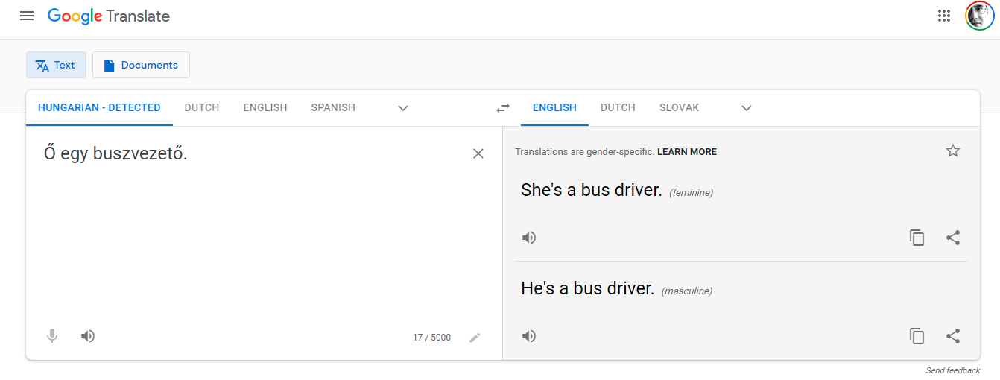

+++
title = "The Problem of Gender Bias In Machine Translation"
date = 2021-03-31T09:00:00
lastmod = 2021-03-31T09:00:00
draft = false

authors = ["Daniel Antal"]

tags = ["Hungary", "trustworthy-AI", "translation", "Google", "sexism"]

summary = "An interesting meme is going around on social media that shows the gender specific translations created by Google Translate from a source text typed in a genderless language, Hungarian."

# Featured image
[image]
  # Caption (optional)
  caption = ""

  # Focal point (optional)
  # Options: Smart, Center, TopLeft, Top, TopRight, Left, Right, BottomLeft, Bottom, BottomRight
  focal_point = "Top"

  # Show image only in page previews?
  preview_only = true

+++

An interesting meme is going around on social media that shows the gender specific translations created by Google Translate from a source text typed in a genderless language, Hungarian.



I was able to replicate this problem in several languages — English, Dutch, French, and German — and I am quite certain that the list could grow. What is going on here?





I treat Data Feminism, the magnum opus of Catherine D’Ignazio and Lauren F. Klein as a guidebook to all sorts of power-related problems in big data, not only those specifically pertaining to womxn. The reason why Slovak artists of any gender are less likely to be recommended by a music streaming platform are similar to why Google Translate assumes “the professor” is a “he” every time. In this case, of course, the problems of data and power that we see so clearly represented here do specifically deal with gender and sexism.



> [T]he past data in question (like segregated housing patterns or single parentage) are products of structurally unequal conditions. These unequal conditions are true across large social groups, and yet the technology uses those data as predictive elements that will influence one person’s future. […] This is one of the challenges of using data about people as an input into a system: the data are never “raw.” Data are always the product of unequal social relations — relations affected by centuries of history. As computer scientist Ben Green states, “Although most people talk about machine learning’s ability to predict the future, what it really does is predict the past.” — [Introduction to Data Feminism](https://mitsap.medium.com/data-feminism-ad4263858321) by Catherine D’Ignazio and Lauren F. Klein

The problem here is that Google has “read” all books, translations, dictionaries and whatever it can get its proverbial hands on, as well as recording for years how people use and correct its translation tool. In a patriarchal society, more men drive buses then women, and women are more often considered and described as beautiful than they are strong. Google considers the most used translation in the past the one that is most likely to be correct in future cases.

(To Google’s credit, if you enter only a single term, not an entire text, it explains the problem. The Hungarian language does not use gendered nouns and pronouns — even though Hungarian society is quite patriarchal in other ways!)

Big data reenforces existing power imbalances because it projects the past into the present and the future, through numbers and language. As a study published by the [European Union Agency For Fundamental Rights](https://fra.europa.eu/), [Getting the future right — Artificial intelligence and fundamental rights argues, justice and equality are fundamental rights](https://fra.europa.eu/en/publication/2020/artificial-intelligence-and-fundamental-rights) argues, justice and equality are fundamental rights. Accordingly, everyone must have the right to challenge an algorithm that discriminates against them, in music streaming, recruitment processes, or other contexts, in court.

Therefore, a transparent, accountable, trustworthy AI is one that constantly checks for biases and changes them. This is the reason why black-box, proprietary algorithms can do more harm than good. If you want to correct injustices in music streaming, in everyday language use, or in a recruitment process, you must be able to verify the training dataset of an algorithm, its working principles, and its outcome as unbiased.

*Our startup has initiated several collaborations open for citizen scientists, individual artists, universities and corporations as well to create validated, trustworthy datasets to train accountable algorithms. We are currently focusing on music and climate change, and will start new data programs in other cultural and environmental areas.*

##Update

<blockquote class="twitter-tweet">
Here&#39;s our discussion one of the potential methods of combating bias <a href="https://t.co/F2rUCbATpI">https://t.co/F2rUCbATpI</a>
&mdash; Davit Soselia (@SoseliaDavit) <a href="https://twitter.com/SoseliaDavit/status/1377928893257166850?ref_src=twsrc%5Etfw">April 2, 2021</a></blockquote> 

- [Davit Soselia & Shota Amashukeli: How Deep Neural Networks Learn Gender Bias](https://blog.finsentim.com/how-deep-neural-networks-learn-gender-bias-4ac64ca07915?gi=71046f8251e0)